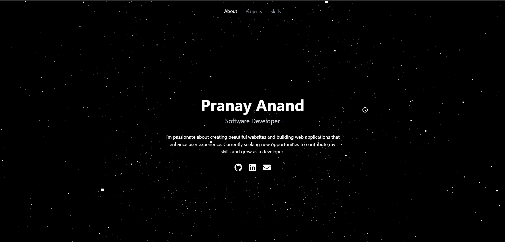

# Space-Themed Portfolio Website

A modern, interactive portfolio website featuring a spinning black hole background, custom cursor effects, and SEO optimization. Built with React and Three.js.



## 🌟 Features

- **Interactive Black Hole Background**: A mesmerizing 3D black hole animation created with Three.js
- **Custom Space Cursor**: Unique cursor design with smooth trailing effects
- **Single Page Design**: Clean, scrollless interface with smooth transitions
- **Responsive Layout**: Optimized for all screen sizes
- **Modern UI**: Minimalist design with glass-morphism effects
- **Contact Form**: Enhanced form with validation and EmailJS integration
- **SEO Optimized**: Structured data, meta tags, and sitemap for better visibility

## 🚀 Technologies Used

- React.js
- Three.js (for 3D animations)
- Framer Motion (for smooth transitions)
- Tailwind CSS (for styling)
- React Icons
- EmailJS (for contact form)
- React Hot Toast (for notifications)

## 🛠️ Installation

1. Clone the repository:
   ```bash
   git clone https://github.com/pranayanand2001/Portfolio2024.git
   ```

2. Navigate to the project directory:
   ```bash
   cd Portfolio2024
   ```

3. Install dependencies:
   ```bash
   npm install
   ```

4. Set up EmailJS:
   - Create an account at [EmailJS](https://www.emailjs.com/)
   - Create an email template
   - Update credentials in `ContactForm.jsx`

5. Start the development server:
   ```bash
   npm start
   ```

6. Open [http://localhost:3000](http://localhost:3000) to view it in your browser.

## 📁 Project Structure

```
Portfolio2024/
├── src/
│   ├── components/
│   │   ├── App.jsx              # Main application component
│   │   ├── BlackHoleBackground.jsx  # 3D black hole animation
│   │   ├── CustomCursor.jsx     # Custom cursor implementation
│   │   └── ContactForm.jsx      # Enhanced contact form
│   ├── assets/
│   │   └── [project images]
│   └── index.css                # Global styles
├── public/
│   ├── index.html              # SEO-optimized HTML
│   ├── sitemap.xml             # Site structure for search engines
│   ├── robots.txt              # Search engine crawling rules
│   └── manifest.json           # PWA manifest
├── LICENSE                      # MIT License
└── package.json
```

## 🎨 Customization

### Modifying the Black Hole Effect
The black hole animation can be customized in `BlackHoleBackground.jsx`:
- Adjust rotation speed
- Modify particle count
- Change colors and sizes

### Updating Content
Edit the following sections in `App.jsx`:
- About information
- Project details
- Skills list
- Social media links

### Contact Form
Customize the contact form in `ContactForm.jsx`:
- Form validation rules
- Success/error messages
- Email templates
- Form styling

### SEO Settings
Update SEO information in:
- `public/index.html` (meta tags)
- `public/sitemap.xml` (site structure)
- `public/robots.txt` (crawler rules)

### Styling
- Global styles are in `index.css`
- Component-specific styles use Tailwind CSS classes
- Custom cursor styling can be modified in both `index.css` and `CustomCursor.jsx`

## 📱 Responsive Design

The portfolio is fully responsive and optimized for:
- Desktop screens
- Tablets
- Mobile devices

## 🔗 Links

- Live Demo: https://pranayanand2001.github.io/Portfolio/
- GitHub: [https://github.com/pranayanand2001](https://github.com/pranayanand2001)
- LinkedIn: [https://www.linkedin.com/in/pranayanand2001](https://www.linkedin.com/in/pranayanand2001)

## 📄 License

This project is open source and available under the [MIT License](LICENSE).

## 👤 Author

**Pranay Anand**
- Email: pranayanand2001@gmail.com
- GitHub: [@pranayanand2001](https://github.com/pranayanand2001)
- LinkedIn: [Pranay Anand](https://www.linkedin.com/in/pranayanand2001)

## 🤝 Contributing

Contributions, issues, and feature requests are welcome! Feel free to check the [issues page](https://github.com/pranayanand2001/Portfolio2024/issues).

## ⭐ Show your support

Give a ⭐️ if you like this project! 
